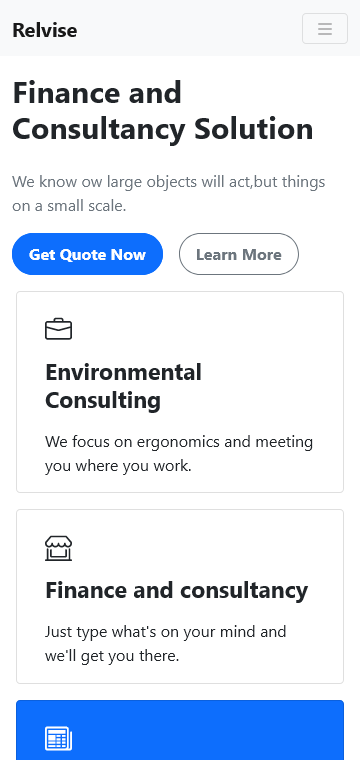

# Landing Page Practice

[**Открыть онлайн**](https://try-again-later.github.io/Landing-Page-Practice/)

Простой проект, который я сделал, чтобы ознакомиться с фреймворком [Bootstrap](https://getbootstrap.com/). Я также использовал шаблонизатор [Pug](https://pugjs.org/), чтобы избежать написания повторяющегося HTML для нескольких экземпляров одного и того же компонента на странице. Я также использовал [Express](https://expressjs.com/) в качестве дев сервера.

---

[**Live version**](https://try-again-later.github.io/Landing-Page-Practice/)

Just a simple project I did to get familiar with the [Bootstrap](https://getbootstrap.com/) framework. I also used [Pug](https://pugjs.org/) templating engine to avoid writing repetitive HTML for multiple instances of the same component on the page. I also used [Express](https://expressjs.com/) as a dev server.

## Run locally

```sh
npm run dev
```

The project will be available at [localhost:3000/Landing-Page-Practice](http://localhost:3000/Landing-Page-Practice/).

## Build

```sh
npm run build
```

Generated files will be available under the `dist` folder.

## Screenshots

 
